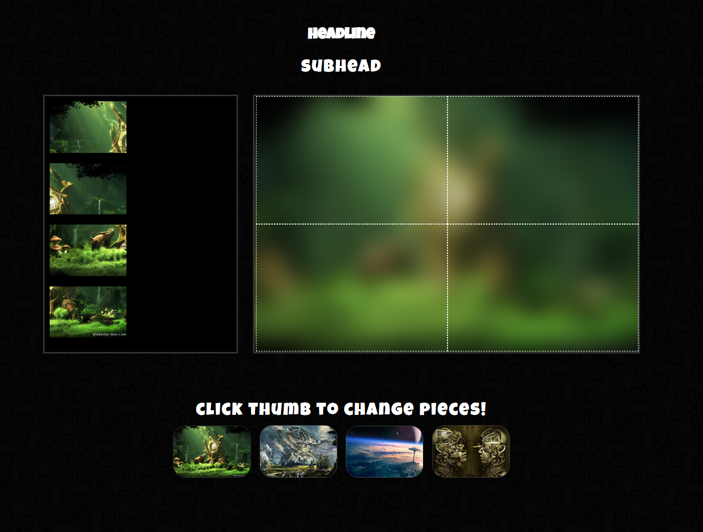

# Crushing Bugs Project

This is a drag and drop puzzle game that features four different puzzles to complete. 
In this prject, I crushed two different bugs that were a problem in the files we worked through in class. The first problem with the code was that you could drag more than one puzzle piece on top of each other. The second bug was that the puzzle pieces would stay on the puzzle board after changing the puzzle set that you want. 

### Getting Started
This is a basic HTML / CSS / JavaScript build.

To view the page, clone this to the location of your choice, and open the ".html" file.

You can also view the source code by opening it in any code editing program of  your choice, or clicking inspect in a chrome tab.

### Prerequisites
All you need to run this Drag and Drop Puzzle is an up to date browser.

## Authors
1. Greg Avery - Front End Dev & Designer